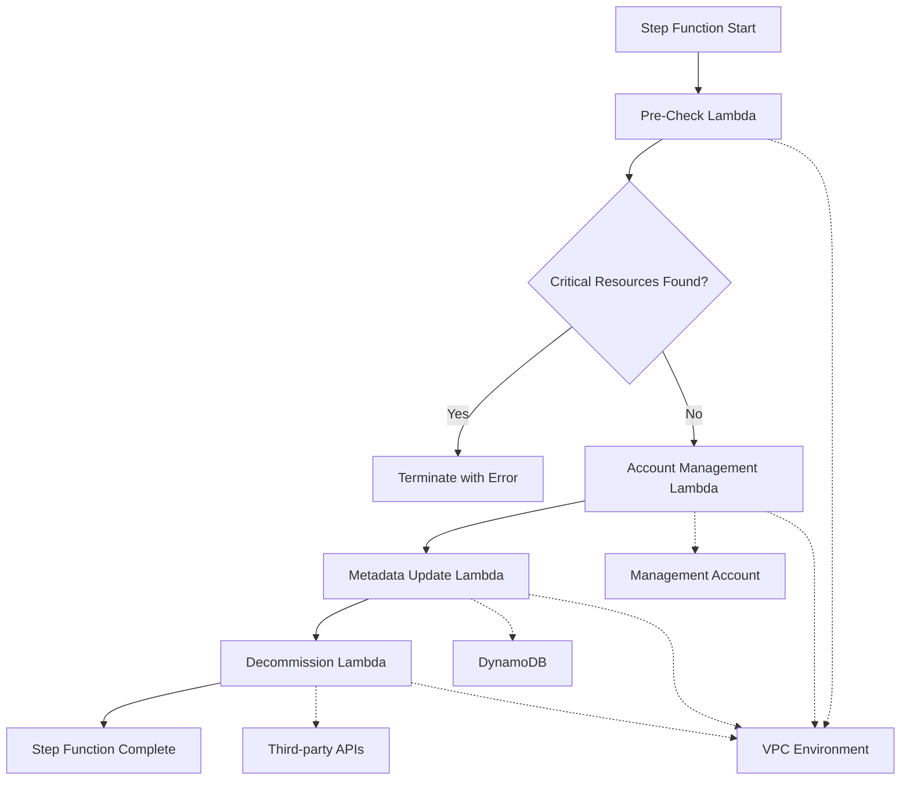

# AWS Account Termination Solution Design

## Overview

The AWS Account Termination Solution is a serverless, event-driven system built using AWS Step Functions to orchestrate the safe termination of AWS accounts. The solution implements a multi-stage workflow that validates account safety, manages account lifecycle through AWS Organizations, updates metadata records, and decommissions third-party integrations.

The system follows AWS Well-Architected Framework principles, emphasizing security, reliability, and operational excellence. All components are deployed using AWS CDK TypeScript for infrastructure-as-code best practices.

## Architecture

The solution uses a Step Functions state machine to orchestrate four main Lambda functions in sequence:



### Key Architectural Decisions

1. **Step Functions Choice**: Provides visual workflow management, built-in error handling, and automatic retry capabilities
2. **VPC Deployment**: All Lambda functions execute within a VPC for network isolation and security
3. **Sequential Processing**: Each stage must complete successfully before proceeding to ensure data consistency
4. **Fail-Fast Approach**: Pre-checks prevent destructive operations on accounts with critical resources
5. **Idempotent Operations**: All functions can be safely retried without side effects

## Components and Interfaces

### Step Function State Machine

**Purpose**: Orchestrates the account termination workflow
**Input**: `{ "accountId": "123456789012" }`
**States**:
- PreCheck: Validates account safety
- AccountManagement: Suspends and closes account
- MetadataUpdate: Updates DynamoDB records
- VendorDecommission: Cleans up third-party integrations

**Error Handling**: Implements exponential backoff retry for transient failures, immediate failure for validation errors

### Pre-Check Lambda Function

**Purpose**: Validates account state before termination
**Runtime**: Node.js 18.x
**Memory**: 512 MB
**Timeout**: 5 minutes
**VPC Configuration**: Private subnets with NAT gateway access

**Interface**:
```typescript
interface PreCheckInput {
  accountId: string;
}

interface PreCheckOutput {
  accountId: string;
  safeToTerminate: boolean;
  resourcesFound: {
    ebsVolumes: number;
    rdsInstances: number;
  };
  timestamp: string;
}
```

### Account Management Lambda Function

**Purpose**: Manages account suspension and closure through AWS Organizations
**Runtime**: Node.js 18.x
**Memory**: 1024 MB
**Timeout**: 10 minutes
**VPC Configuration**: Private subnets with VPC endpoints for AWS APIs

**Interface**:
```typescript
interface AccountManagementInput {
  accountId: string;
}

interface AccountManagementOutput {
  accountId: string;
  suspended: boolean;
  closureInitiated: boolean;
  organizationalUnit: string;
  timestamp: string;
}
```

### Metadata Update Lambda Function

**Purpose**: Updates DynamoDB with account termination metadata
**Runtime**: Node.js 18.x
**Memory**: 256 MB
**Timeout**: 3 minutes
**VPC Configuration**: Private subnets with DynamoDB VPC endpoint

**Interface**:
```typescript
interface MetadataUpdateInput {
  accountId: string;
  terminationStatus: string;
  executionArn: string;
}

interface MetadataUpdateOutput {
  accountId: string;
  recordUpdated: boolean;
  timestamp: string;
}
```

### Decommission Lambda Function

**Purpose**: Handles third-party vendor cleanup operations
**Runtime**: Node.js 18.x
**Memory**: 512 MB
**Timeout**: 15 minutes
**VPC Configuration**: Private subnets with internet access for vendor APIs

**Interface**:
```typescript
interface DecommissionInput {
  accountId: string;
}

interface DecommissionOutput {
  accountId: string;
  vendorsProcessed: string[];
  results: {
    [vendor: string]: {
      success: boolean;
      message: string;
    };
  };
  timestamp: string;
}
```

## Data Models

### Account Metadata (DynamoDB)

```typescript
interface AccountMetadata {
  accountId: string; // Partition Key
  status: 'ACTIVE' | 'TERMINATING' | 'TERMINATED' | 'FAILED';
  terminationInitiated: string; // ISO timestamp
  terminationCompleted?: string; // ISO timestamp
  executionArn: string;
  preCheckResults: {
    ebsVolumes: number;
    rdsInstances: number;
    safeToTerminate: boolean;
  };
  organizationalUnit: string;
  vendorDecommissionResults: {
    [vendor: string]: {
      success: boolean;
      message: string;
      timestamp: string;
    };
  };
  createdAt: string;
  updatedAt: string;
}
```

### Step Function Execution Context

```typescript
interface ExecutionContext {
  accountId: string;
  executionArn: string;
  startTime: string;
  currentStage: string;
  results: {
    preCheck?: PreCheckOutput;
    accountManagement?: AccountManagementOutput;
    metadataUpdate?: MetadataUpdateOutput;
    decommission?: DecommissionOutput;
  };
}
```

## Correctness Properties

*A property is a characteristic or behavior that should hold true across all valid executions of a system-essentially, a formal statement about what the system should do. Properties serve as the bridge between human-readable specifications and machine-verifiable correctness guarantees.*

<function_calls>
<invoke name="prework">
<parameter name="featureName">aws-account-termination
### Property Reflection

After reviewing all identified properties, several can be consolidated to eliminate redundancy:

**Consolidations Made:**
- Properties 2.1 and 2.3 (EBS and RDS scanning) combined into comprehensive resource scanning property
- Properties 2.2 and 2.4 (EBS and RDS safety violations) combined into unified safety violation property  
- Properties 3.4 and 4.4 (error handling) consolidated into general error handling property
- Properties 3.5 and 4.5 (success confirmations) consolidated into general success confirmation property
- Properties 7.1, 7.2, 7.5 (logging behaviors) consolidated into comprehensive logging property
- Properties 8.1, 8.2, 8.3 (AWS best practices) consolidated into unified best practices property

**Property 1: Input validation consistency**
*For any* input to the Step Function, valid account IDs should initiate the workflow while invalid inputs should terminate with appropriate error messages and audit logs
**Validates: Requirements 1.1, 1.2**

**Property 2: Sequential workflow execution**
*For any* Step Function execution, stages should process sequentially and handle failures gracefully by halting execution with detailed error information
**Validates: Requirements 1.3, 1.4**

**Property 3: Successful completion behavior**
*For any* successful Step Function execution, the workflow should return completion status with comprehensive summary information
**Validates: Requirements 1.5**

**Property 4: Resource scanning completeness**
*For any* target account, the Pre-Check Lambda should scan for both EBS volumes and RDS instances and return accurate counts
**Validates: Requirements 2.1, 2.3**

**Property 5: Safety violation detection**
*For any* account containing EBS volumes or RDS instances, the Pre-Check Lambda should halt the workflow and return safety violation errors
**Validates: Requirements 2.2, 2.4**

**Property 6: Clean account processing**
*For any* account without critical resources, the Pre-Check Lambda should return success status allowing workflow continuation
**Validates: Requirements 2.5**

**Property 7: Management account role assumption**
*For any* Account Management Lambda execution, the function should successfully assume a role in the Management Account with appropriate permissions
**Validates: Requirements 3.1**

**Property 8: Account suspension workflow**
*For any* valid account, the Account Management Lambda should move the account to Suspended OU and initiate closure process
**Validates: Requirements 3.2, 3.3**

**Property 9: Consistent error handling**
*For any* operation failure across all Lambda functions, detailed error information including AWS API error codes should be returned
**Validates: Requirements 3.4, 4.4**

**Property 10: Success confirmation consistency**
*For any* successful operation across all Lambda functions, confirmation with operation details should be returned
**Validates: Requirements 3.5, 4.5**

**Property 11: Metadata persistence**
*For any* account termination, the Metadata Lambda should update DynamoDB with termination timestamp and workflow execution details
**Validates: Requirements 4.1, 4.2**

**Property 12: Retry mechanism reliability**
*For any* DynamoDB operation failure, the Metadata Lambda should implement exponential backoff retry up to three attempts
**Validates: Requirements 4.3**

**Property 13: Vendor decommissioning initiation**
*For any* account, the Decommission Lambda should initiate Prisma vendor cleanup operations and remove account-specific configurations
**Validates: Requirements 5.1, 5.2**

**Property 14: Vendor API retry behavior**
*For any* vendor API failure, the Decommission Lambda should implement retry logic with appropriate backoff strategies
**Validates: Requirements 5.3**

**Property 15: Vendor failure tolerance**
*For any* vendor decommissioning failure after retries, the function should log the failure but allow workflow continuation with operation summary
**Validates: Requirements 5.4, 5.5**

**Property 16: VPC deployment consistency**
*For any* Lambda function deployment, all functions should be placed within the existing VPC environment with appropriate security groups
**Validates: Requirements 6.1, 6.2**

**Property 17: Network connectivity assurance**
*For any* Lambda function execution, functions should have network access to required AWS services and VPC should enforce security policies
**Validates: Requirements 6.3, 6.4, 6.5**

**Property 18: Comprehensive logging behavior**
*For any* Lambda function error, Step Function state transition, or workflow completion, detailed logs should be generated for audit and compliance
**Validates: Requirements 7.1, 7.2, 7.5**

**Property 19: Retry policy implementation**
*For any* error occurrence, the Step Function should implement appropriate retry policies with exponential backoff where applicable
**Validates: Requirements 7.3**

**Property 20: Critical failure notifications**
*For any* critical failure, the Step Function should send notifications to administrators through appropriate channels
**Validates: Requirements 7.4**

**Property 21: AWS best practices compliance**
*For any* resource deployment, the CDK Stack should follow least privilege IAM, appropriate timeouts, and AWS naming/tagging best practices
**Validates: Requirements 8.1, 8.2, 8.3**

**Property 22: Data encryption consistency**
*For any* sensitive data handling, Lambda functions should encrypt data in transit and at rest using AWS managed keys
**Validates: Requirements 8.4**

**Property 23: Audit trail completeness**
*For any* solution implementation, CloudTrail logging should be enabled for all API calls and resource changes
**Validates: Requirements 8.5**

## Error Handling

### Error Categories

1. **Validation Errors**: Invalid account ID format, missing required parameters
2. **Safety Violations**: Critical resources found during pre-check
3. **Permission Errors**: Insufficient IAM permissions for operations
4. **Service Errors**: AWS API failures, network connectivity issues
5. **Vendor Errors**: Third-party API failures or timeouts

### Error Handling Strategy

**Step Function Level**:
- Implement exponential backoff retry for transient failures
- Use Catch blocks to handle specific error types
- Maintain execution context across retries
- Generate detailed error reports for troubleshooting

**Lambda Function Level**:
- Structured error logging with correlation IDs
- Graceful degradation for non-critical failures
- Input validation with descriptive error messages
- Timeout handling with partial result preservation

**Recovery Mechanisms**:
- Idempotent operations allow safe retries
- Partial failure handling preserves completed work
- Manual intervention workflows for complex failures
- Rollback capabilities for critical operations

## Testing Strategy

### Dual Testing Approach

The solution implements both unit testing and property-based testing to ensure comprehensive coverage:

**Unit Tests**:
- Verify specific examples and edge cases
- Test integration points between components
- Validate error conditions and boundary values
- Cover AWS SDK integration scenarios

**Property-Based Tests**:
- Verify universal properties across all inputs using **fast-check** library
- Each property-based test runs minimum 100 iterations
- Tests tagged with format: **Feature: aws-account-termination, Property {number}: {property_text}**
- Each correctness property implemented by single property-based test

### Testing Framework Configuration

**Unit Testing**: Jest with AWS SDK mocking
**Property-Based Testing**: fast-check library
**Integration Testing**: AWS CDK integration tests
**Infrastructure Testing**: CDK assertions and AWS Config rules

### Test Categories

1. **Input Validation Tests**: Account ID format validation, parameter validation
2. **Resource Detection Tests**: EBS and RDS scanning accuracy
3. **AWS Integration Tests**: Organizations API, DynamoDB operations
4. **Vendor Integration Tests**: Prisma API interactions with mocking
5. **Error Handling Tests**: Retry mechanisms, failure scenarios
6. **Security Tests**: IAM permissions, encryption validation
7. **Performance Tests**: Timeout handling, resource utilization

### Continuous Testing

- Automated testing in CI/CD pipeline
- Integration tests against AWS sandbox accounts
- Property-based test execution with randomized inputs
- Security scanning and compliance validation
- Performance benchmarking and monitoring