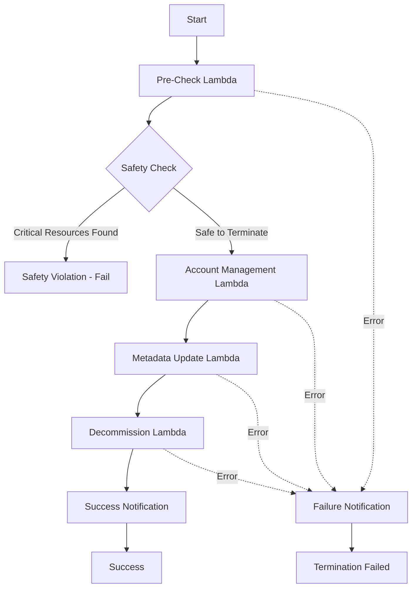

# AWS Account Termination Solution

A secure, automated workflow for safely terminating AWS accounts using AWS Step Functions, Lambda functions, and CDK for infrastructure-as-code.

## 🚀 Simplified Architecture

This solution has been optimized for simplicity and maintainability with a clean, flat structure:
- **Single CDK Stack**: `src/stack.ts` contains all infrastructure
- **Unified Configuration**: `src/config.ts` combines AWS config and logging utilities  
- **Centralized Interfaces**: `src/interfaces.ts` contains all TypeScript type definitions
- **Clean Lambda Structure**: Each Lambda function in its own directory with minimal files

## 🏗️ Overview

This solution provides a comprehensive account termination process that:
- ✅ Validates account safety before termination
- ✅ Manages account suspension through AWS Organizations
- ✅ Updates metadata records in DynamoDB
- ✅ Handles third-party vendor decommissioning
- ✅ Maintains comprehensive audit trails
- ✅ Provides real-time monitoring and alerting
- ✅ Follows AWS security best practices

## 🎯 Quick Start

```bash
# 1. Clone and setup
git clone <repository-url>
cd aws-account-termination
npm install

# 2. Configure environment
cp .env.example .env
# Edit .env with your settings

# 3. Deploy
./deploy.sh
```

## 📋 Architecture

The solution uses AWS Step Functions to orchestrate four main Lambda functions:
1. **Pre-Check Lambda** - Validates account state and scans for critical resources
2. **Account Management Lambda** - Handles account suspension and closure
3. **Metadata Update Lambda** - Updates DynamoDB with termination metadata
4. **Decommission Lambda** - Manages third-party vendor cleanup

### Step Functions Workflow

The state machine implements the following workflow:



**Key Features:**
- **Sequential Processing**: Each stage must complete successfully before proceeding
- **Fail-Fast Approach**: Pre-checks prevent destructive operations on accounts with critical resources
- **Retry Policies**: Exponential backoff retry for transient failures (2s initial, 2x backoff, 3 max attempts)
- **Error Handling**: Comprehensive error capture with detailed logging
- **Monitoring**: CloudWatch logging with execution data and X-Ray tracing enabled
- **Notifications**: SNS notifications for success and failure scenarios
- **Timeout Protection**: 2-hour maximum execution time with per-task timeouts

**Input Format:**
```json
{
  "accountId": "123456789012"
}
```

**Success Output:**
```json
{
  "accountId": "123456789012",
  "vendorsProcessed": ["Prisma"],
  "results": {
    "Prisma": {
      "success": true,
      "message": "Account successfully decommissioned"
    }
  },
  "timestamp": "2024-01-01T00:00:00.000Z"
}
```

## 📁 Project Structure

```
├── src/
│   ├── app.ts                          # CDK app entry point
│   ├── stack.ts                        # Main CDK stack (simplified)
│   ├── interfaces.ts                   # All TypeScript interfaces
│   ├── config.ts                       # Configuration utilities & logging
│   └── lambdas/                        # Lambda function implementations
│       ├── pre-check/
│       │   ├── index.py
│       │   └── requirements.txt
│       ├── account-management/
│       │   ├── index.py
│       │   └── requirements.txt
│       ├── metadata-update/
│       │   ├── index.py
│       │   └── requirements.txt
│       └── decommission/
│           ├── index.py
│           └── requirements.txt
├── test/
│   ├── setup.ts                        # Jest test configuration
│   ├── stack.test.ts                   # CDK stack tests
│   ├── interfaces.test.ts              # Interface validation tests
│   ├── config.test.ts                  # Configuration & logging tests
│   └── property/                       # Property-based tests
│       └── input-validation.property.test.ts
├── deploy.sh                           # Production deployment script
├── .env.example                        # Environment configuration template
├── DEPLOYMENT.md                       # Detailed deployment guide
├── cdk.json                           # CDK configuration
├── jest.config.js                     # Jest configuration
└── package.json                       # Dependencies and scripts
```

## 🚀 Usage

### Executing Account Termination

1. **Via AWS Console:**
   - Navigate to Step Functions in AWS Console
   - Find the "AccountTermination-Workflow-{env}" state machine
   - Click "Start execution"
   - Provide input: `{"accountId": "123456789012"}`

2. **Via AWS CLI:**
   ```bash
   aws stepfunctions start-execution \
     --state-machine-arn arn:aws:states:region:account:stateMachine:AccountTermination-Workflow-prod \
     --input '{"accountId": "123456789012"}' \
     --name "termination-$(date +%s)"
   ```

3. **Via AWS SDK:**
   ```typescript
   import { StepFunctionsClient, StartExecutionCommand } from "@aws-sdk/client-sfn";
   
   const client = new StepFunctionsClient({ region: "us-east-1" });
   const command = new StartExecutionCommand({
     stateMachineArn: "arn:aws:states:region:account:stateMachine:AccountTermination-Workflow-prod",
     input: JSON.stringify({ accountId: "123456789012" }),
     name: `termination-${Date.now()}`
   });
   
   const result = await client.send(command);
   ```

### Monitoring Execution

- **CloudWatch Logs**: `/aws/stepfunctions/AccountTermination-{env}`
- **X-Ray Tracing**: Enabled for distributed tracing
- **Step Functions Console**: Visual execution progress and error details
- **SNS Notifications**: Email alerts for success/failure

## 🛠️ Development

### Prerequisites

- Node.js 18.x or later
- AWS CLI configured with appropriate permissions
- AWS CDK CLI installed globally
- Python 3.12 (for Lambda functions)

### Setup

```bash
# Install dependencies
npm install

# Build the project
npm run build

# Run tests
npm test

# Run tests in watch mode
npm run test:watch

# Run property-based tests
npm run test:property

# Deploy to development
npm run deploy:dev

# Synthesize CloudFormation template
npm run synth
```

## 🧪 Testing

The project uses a dual testing approach:
- **Unit Tests**: Jest for specific examples and edge cases
- **Property-Based Tests**: fast-check for universal properties across all inputs
- **Integration Tests**: CDK stack validation and AWS service integration

### Test Commands

```bash
# Run all tests
npm test

# Run with coverage
npm run test:coverage

# Run specific test types
npm run test:integration
npm run test:property

# Watch mode for development
npm run test:watch
```

## 🔧 Configuration

### Environment Variables

Copy `.env.example` to `.env` and configure:

```bash
# Required
AWS_REGION=us-east-1
ENVIRONMENT=prod
NOTIFICATION_EMAIL=admin@company.com
MANAGEMENT_ACCOUNT_ROLE_ARN=arn:aws:iam::MGMT:role/AccountTermination-ManagementAccount-Role
SUSPENDED_OU_ID=ou-root-suspended123

# Optional
VPC_ID=vpc-existing123
PRIVATE_SUBNET_IDS=subnet-123,subnet-456
PRISMA_API_KEY=your-key
PRISMA_SECRET_KEY=your-secret
```

### Multi-Environment Support

The solution supports multiple environments:

```bash
# Development
ENVIRONMENT=dev ./deploy.sh

# Staging  
ENVIRONMENT=staging ./deploy.sh

# Production
ENVIRONMENT=prod ./deploy.sh
```

## 🔐 Security

- **Principle of Least Privilege**: All IAM roles follow minimal permissions
- **Network Isolation**: All Lambda functions deployed in VPC private subnets
- **Encryption**: Data encrypted in transit and at rest using AWS managed keys
- **Audit Logging**: Comprehensive CloudTrail logging enabled
- **Security Groups**: Restrictive network access controls
- **Dead Letter Queues**: Failed invocations captured for analysis
- **Reserved Concurrency**: Prevents runaway executions

## 📊 Monitoring & Alerting

### CloudWatch Alarms

- Lambda function error rates and duration
- Step Functions execution failures
- DynamoDB throttling and errors

### Notifications

- SNS topic for real-time alerts
- Email notifications for critical events
- Structured logging with correlation IDs

### Metrics

- Execution success/failure rates
- Processing times per stage
- Resource utilization metrics

## 🚀 Deployment

See [DEPLOYMENT.md](DEPLOYMENT.md) for detailed deployment instructions.

### Quick Deploy

```bash
./deploy.sh
```

### Manual Deploy

```bash
cdk deploy AccountTerminationStack \
  --context environment=prod \
  --parameters managementAccountRoleArn=arn:aws:iam::MGMT:role/Role \
  --parameters suspendedOuId=ou-root-123 \
  --parameters notificationEmail=admin@company.com
```

## 🔄 Maintenance

### Updates

```bash
# Pull latest changes
git pull origin main

# Update dependencies
npm update

# Deploy updates
./deploy.sh
```

### Health Checks

```bash
# Check stack status
aws cloudformation describe-stacks --stack-name AccountTerminationStack

# View recent executions
aws stepfunctions list-executions --state-machine-arn <ARN> --max-items 10

# Monitor logs
aws logs tail /aws/stepfunctions/AccountTermination-prod --follow
```

## 🐛 Troubleshooting

### Common Issues

1. **CDK Bootstrap Required**: Run `cdk bootstrap`
2. **Insufficient Permissions**: Verify IAM roles and cross-account trust
3. **VPC Issues**: Check NAT gateway and security group configuration
4. **Lambda Timeouts**: Review CloudWatch logs for specific errors

### Debug Commands

```bash
# View execution details
aws stepfunctions describe-execution --execution-arn <ARN>

# Check Lambda logs
aws logs tail /aws/lambda/AccountTermination-PreCheck-prod --follow

# Validate CDK template
npm run synth
```

## 📄 License

MIT

## 🤝 Contributing

1. Fork the repository
2. Create a feature branch
3. Make your changes
4. Add tests for new functionality
5. Ensure all tests pass
6. Submit a pull request

## 📞 Support

For issues and questions:
1. Check CloudWatch logs for detailed error messages
2. Review the troubleshooting section
3. Verify environment configuration
4. Test with a non-production account first